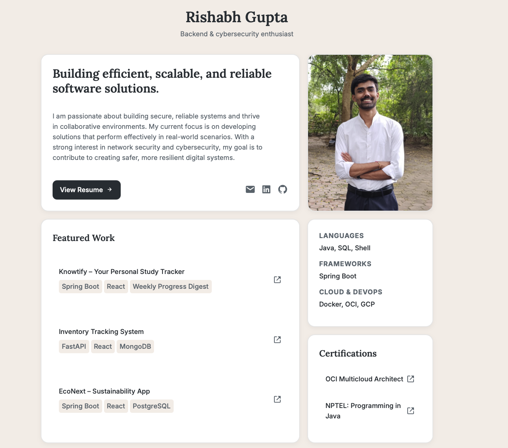

# Rishabh Gupta - Personal Portfolio Website


This repository contains the source code for my personal portfolio website. It is a clean, modern, single-page application designed to showcase my skills, projects, and professional background in a visually appealing and easy-to-navigate format.

**[➡️ Live Demo Here]( https://rishabhgupta49.netlify.app)*

---

### Screenshot

 

---

## Design Philosophy

The design and technology choices for this portfolio were deliberate and focused on achieving specific goals: modern appeal, clarity of information, and excellent performance.

### Why a Bento Grid Layout?

The "bento box" design is a modern UI/UX trend that offers significant advantages for a portfolio:

* **High Information Density:** It allows multiple, distinct pieces of information (hero statement, projects, skills, certifications) to be presented on one screen without looking cluttered. This respects the time of recruiters and visitors.
* **Visual Hierarchy:** The grid structure allows for the strategic sizing of blocks to emphasize key information. The largest sections are dedicated to my value proposition (the hero section) and my work (the projects), immediately drawing the user's eye.
* **Modularity and Scalability:** The design is inherently modular. It was simple to add a new "Certifications" block without refactoring the entire layout. This makes the portfolio easy to update as my career grows.
* **Engaging User Experience:** The grid encourages exploration by presenting content in digestible, "snackable" chunks, making the site feel interactive and less like a static document.

### Why a Simple, Static Website Works

While I have experience building complex applications, a static site (HTML/CSS) was the most effective choice for this portfolio.

* **Peak Performance:** Static sites are incredibly fast. With no database queries or server-side rendering, the content is served to the user almost instantly. This provides a seamless user experience, which is critical for making a good first impression.
* **Enhanced Security:** The absence of a server-side backend or database significantly minimizes the attack surface. This makes the website inherently secure.
* **Focus on Content:** The primary goal of a portfolio is to **showcase work and skills**. A simple, clean frontend ensures that the focus remains on the content itself, not on complex, unnecessary features.
* **Low-Cost & Easy Deployment:** Static websites can be hosted for free on platforms like GitHub Pages, Netlify, or Vercel, and deployment is straightforward.
* **Maintainability:** The codebase is minimal and clean, making it incredibly easy to maintain and update in the future.

---

##  Tech Stack

This project was built from the ground up using fundamental web technologies, with a focus on clean, semantic code.

* **HTML5:** For the core structure and content.
* **CSS3:** For all styling, layout, and responsiveness.
    * **CSS Grid Layout:** Used to create the bento box structure.
    * **CSS Flexbox:** Used for aligning items within components.
    * **Custom Properties (Variables):** For a maintainable and consistent color scheme and typography.
* **Boxicons:** For clean, lightweight SVG icons.

---

## Features

* **Fully Responsive Design:** Adapts seamlessly from large desktop screens to mobile devices.
* **Interactive Bento Grid:** An engaging layout that organizes all key information on a single page.
* **Hero Section:** A concise introduction highlighting my core competencies and career interests.
* **Featured Projects:** A curated list of my best work with descriptions, tech tags, and direct links to live demos.
* **Skills & Certifications:** Dedicated sections for a quick overview of my technical skills and professional certifications.

---

## Local Setup & Usage

No complex build tools or dependencies are required.

1.  **Clone the repository:**
    ```bash
    git clone [https://github.com/RishabhGuptaIT2k2149/your-portfolio-repo.git](https://github.com/RishabhGuptaIT2k2149/your-portfolio-repo.git)
    ```
2.  **Navigate to the project directory:**
    ```bash
    cd your-portfolio-repo
    ```
3.  **Open in your browser:**
    * Simply open the `index.html` file in your web browser of choice.

---

##  File Structure

The project structure is intentionally simple and organized for clarity.

```
.
├── images/
│   ├── profile-picture.jpg
│   └── screenshot.png
├── index.html
├── style.css
└── README.md
```

---

##Contact

Let's connect! I'm always open to discussing new projects and opportunities.

* **Email:** `rishabh.gupta7692@gmail.com`
* **LinkedIn:** [linkedin.com/in/rishabh-gupta-150082277](https://www.linkedin.com/in/rishabh-gupta-150082277/)
* **GitHub:** [@RishabhGuptaIT2k2149](https://github.com/RishabhGuptaIT2k2149)
